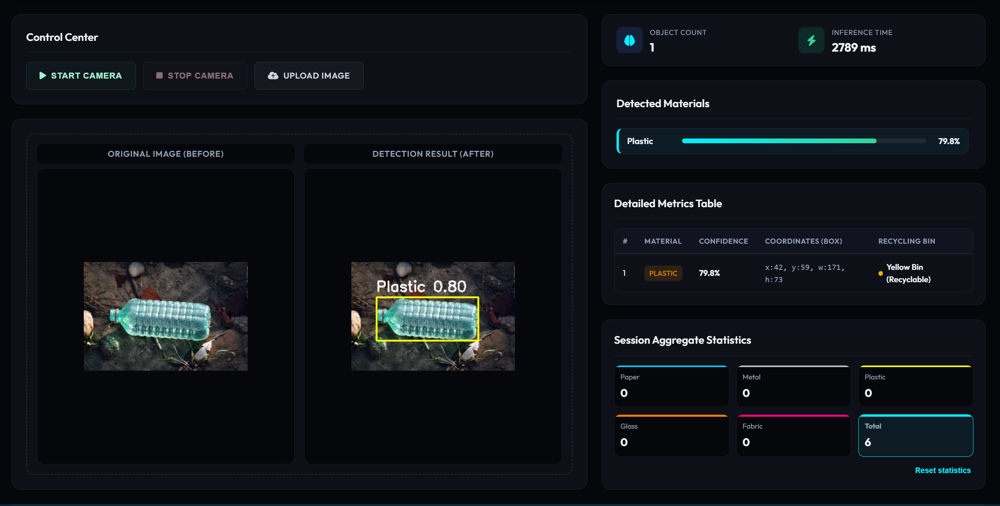

# Material Classification System (Hệ thống Phân loại Vật liệu Tái chế)

Dự án này là phiên bản nâng cấp của một dự án cũ. Dự án này được cải thiện, tối ưu hóa (cụ thể là giao diện đẹp hơn :v)

## 🖥️ Giao diện Hệ thống (System Dashboard)

Dưới đây là hình ảnh giao diện thực tế của hệ thống ở chế độ tối giản kim loại Cyberpunk:



---

## ✨ Các tính năng nâng cấp nổi bật

1. **Bảng theo dõi thông số chi tiết (Detailed Metrics Table):**
   - Hiển thị danh sách vật thể được phát hiện theo thứ tự, đi kèm phân loại Badge màu sắc đặc trưng.
   - Hiển thị độ tin cậy cụ thể từ YOLO và tọa độ bounding box chính xác dạng `[x, y, w, h]`.
   - Cung cấp gợi ý hướng dẫn phân loại thùng rác chuẩn quy định (ví dụ: Thùng Vàng cho rác tái chế nhựa/kim loại/giấy, Thùng Đỏ cho vải/rác khác).

2. **Thống kê tổng hợp phiên (Session Aggregates):**
   - Đếm số lượng lũy kế của từng loại vật liệu được nhận diện trong suốt phiên làm việc.
   - Tích hợp giải thuật khử trùng lặp (debounce) thông minh cho camera trực tiếp, tránh hiện tượng đếm lặp một vật thể qua nhiều frame liên tục.

3. **Đồng bộ song ngữ hoàn hảo (Bilingual Support):**
   - Chuyển đổi toàn diện tiếng Anh (EN) và tiếng Việt (VI) ở tất cả các thành phần trên web.
   - **Đặc biệt:** Tên nhãn hiển thị trên bounding box vẽ bằng OpenCV cũng tự động đồng bộ theo ngôn ngữ được chọn (`Plastic` ở tiếng Anh và `Nhua` ở tiếng Việt).

---

## 🛠️ Cài đặt & Khởi chạy (Installation & Run)

### 1. Cài đặt môi trường
Đảm bảo bạn đã cài đặt Python (khuyên dùng Python 3.9 - 3.11).

```bash
# Tạo môi trường ảo
python -m venv vat_lieu

# Kích hoạt môi trường ảo
# Trên Windows (Powershell):
.\vat_lieu\Scripts\activate

# Cài đặt các thư viện phụ thuộc
pip install -r requirements.txt
```

### 2. Khởi chạy Server

```bash
python app.py
```

Sau khi khởi chạy thành công, truy cập giao diện hệ thống qua trình duyệt web tại địa chỉ:
👉 **[http://localhost:5000](http://localhost:5000)** hoặc cổng IP nội bộ hiển thị trên terminal.

---

## 📂 Cấu trúc mã nguồn dịch thuật

Để đảm bảo nguyên lý thiết kế **Clean Code**, toàn bộ dữ liệu giao diện tĩnh và từ điển ánh xạ nhãn được tách biệt hoàn toàn:
- **`app.py`**: Xử lý logic phía server, chạy mô hình YOLO, vẽ khung bounding box đa ngôn ngữ và phát luồng video stream.
- **`static/js/translations.js`**: Chứa toàn bộ cấu hình màu sắc thùng rác (`materialConfig`) và từ điển dịch thuật (`translations`).
- **`static/js/script.js`**: Điều khiển logic phía client (Camera, Ajax Upload, Render giao diện bảng thông số, tính toán bộ lọc debounce).